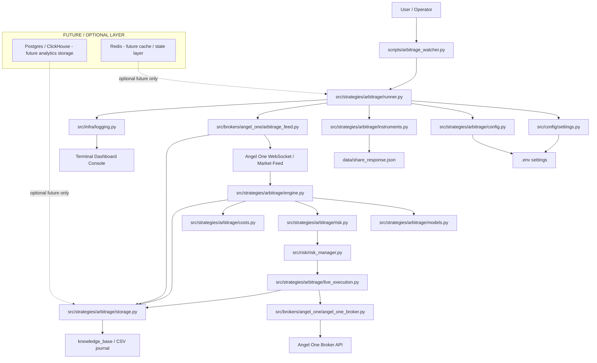

# Arbitrage Architecture Diagram

## Flow explanation

Active flow (current runtime):

1. The watcher starts from the script entry point.
2. Settings and arbitrage configuration are loaded.
3. The instrument catalog is built from market data files.
4. Angel One websocket feed pushes live NSE/BSE quotes.
5. The arbitrage engine evaluates quote freshness and spread.
6. Risk manager decides whether the opportunity is valid.
7. Live executor submits the trade if allowed.
8. CSV journal stores quotes, opportunities, and execution events.
9. The logger formats the output for an easy terminal dashboard view.

Future / optional flow (not active by default):

- Redis may be added later for cache or lightweight state.
- Postgres / ClickHouse may be added later for analytics or long-term storage.
- These services do not participate in the current arbitrage execution path.

## Function map by node

| Node | File | Active function / responsibility |
| --- | --- | --- |
| User start | `scripts/arbitrage_watcher.py` | `main()` starts the arbitrage workflow |
| App bootstrap | `src/strategies/arbitrage/runner.py` | `ArbitrageApplication.run()`; initializes feed, quotes, risk, broker, executor |
| Settings loader | `src/config/settings.py` | `get_settings()` provides environment/config values |
| Arbitrage config | `src/strategies/arbitrage/config.py` | `ArbitrageConfig`; defines symbols, risk caps, notional limits, cooldowns |
| Instrument mapping | `src/strategies/arbitrage/instruments.py` | `load_instruments()` loads symbol-to-exchange mapping |
| Market data feed | `src/brokers/angel_one/arbitrage_feed.py` | receives websocket price updates and pushes normalized quote objects |
| Broker gateway | `src/brokers/angel_one/angel_one_broker.py` | `AngelOneBrokerAdapter`; connects to broker, reads positions, submits trades |
| Arbitrage logic | `src/strategies/arbitrage/engine.py` | `ArbitrageEngine.update_quote()` and opportunity detection |
| Risk gate | `src/strategies/arbitrage/risk.py` | `OpportunityRiskManager.validate()` approves or rejects opportunity |
| Risk state | `src/risk/risk_manager.py` | `RiskManager` and `RiskLimits` enforce daily and position constraints |
| Cost estimation | `src/strategies/arbitrage/costs.py` | cost model used to estimate net profit after fees |
| Execution | `src/strategies/arbitrage/live_execution.py` | `LiveArbitrageExecutor.execute()` executes the buy/sell legs |
| Journal | `src/strategies/arbitrage/storage.py` | `CsvJournal.record_quote()`, `record_opportunity()`, `record_live_execution()` |
| Dashboard logger | `src/infra/logging.py` | `configure_logging()` and `_compact_console_formatter()` output the live colored console |

## Optional / future services

These are not part of the active arbitrage runtime and are intentionally left out of the current workflow.

- Redis: optional future cache or lightweight state layer.
- Postgres: optional future operational or analytical database.
- ClickHouse: optional future high-speed analytics / market data warehouse.

These services should only be added later when the project needs historical storage, cross-day analytics, or a more complex data stack.

## Notes

- This project is intentionally minimal.
- Postgres and ClickHouse are not active by default and are marked as future-only storage.
- Redis is optional and not required for the default arbitrage workflow.
- These services are placeholders for later analytical or operational scaling, not part of the current live trading path.
- The active core design is: market feed -> detection -> risk -> execution -> journal.
- The system is fail-closed by design: no live trading without explicit acknowledgement and guardrails.
