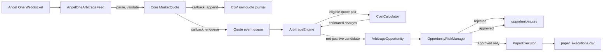

# Arbitrage Tracking: Paper Default, Gated Live Mode

## Overview

The arbitrage tracker watches configured equities on NSE and BSE using live Angel One WebSocket market depth. It evaluates best bid/ask prices, estimates transaction costs, applies freshness and risk checks, and records paper-only execution results as CSV.

Paper mode is the default. A guarded live path is implemented, but it only starts when both `LIVE_TRADING_ENABLED=true` and the exact risk acknowledgement are configured. Do not treat this as live-market certified: all order lifecycle tests use a fake broker, and no real Angel One order has been placed or verified by this project.

Historical candle data is not used for executable arbitrage detection. The tracker captures data only while it is running; it cannot retrieve past individual ticks from Angel One's historical candle API.

## Architecture



### Main modules

- `src/core/entities.py`: broker-neutral `MarketQuote`, containing symbol, exchange, bid/ask, quantities, timezone-aware timestamp, and raw payload.
- `src/brokers/angel_one/arbitrage_feed.py`: Angel One authentication, WebSocket subscription, best-level parsing, validation, retry, and disconnect handling. Vendor-specific exchange codes and SDK calls stay here.
- `strategy/arbitrage/instruments.py`: maps the scrip master in `data/share_response.json` to NSE/BSE tokens.
- `strategy/arbitrage/engine.py`: broker-independent `ArbitrageEngine`. It accepts `MarketQuote` values; it has no Angel One dependency and does not process candle OHLC data.
- `strategy/arbitrage/costs.py`: configurable `CostCalculator` and `CostConfig` for estimated brokerage, transaction charges, STT, stamp duty, SEBI charges, and GST.
- `strategy/arbitrage/risk.py`: validates quantity, notional, estimated net profit, daily loss, and kill-switch status.
- `strategy/arbitrage/paper_execution.py`: simulates fills and the same-exchange fallback. It has no broker/order API dependency.
- `strategy/arbitrage/live_execution.py`: submits exchange-aware limit orders through `IBrokerGateway`, validates every order with `RiskManager`, polls broker order status, cancels unfilled remainder, and attempts a same-exchange fallback within the loss cap.
- `strategy/arbitrage/storage.py`: thread-safe append-only CSV journal.
- `strategy/arbitrage/runner.py`: application wiring and the consumer loop. Spread calculations, risk decisions, and simulated execution run outside the WebSocket callback.
- `strategy/arbitrage_watcher.py`: command-line entry point.

## Quote and Opportunity Flow

1. The Angel One callback receives a WebSocket depth message.
2. The adapter maps exchange/token to a configured symbol, chooses the highest bid and lowest ask from the supplied depth, converts prices from paise to rupees, constructs a `MarketQuote`, and validates it.
3. The application callback appends the normalized quote and its raw payload to `market_quotes.csv`, then publishes the quote to an in-process queue. It does not calculate arbitrage.
4. `ArbitrageEngine` keeps the latest quote for each symbol/exchange. It rejects quote pairs whose timestamps differ by more than `max_quote_age_seconds`, and rejects quotes that are stale or from the future.
5. The engine checks both routes: buy NSE/sell BSE and buy BSE/sell NSE. It uses the buy ask and sell bid, caps quantity by configured paper size and visible top-level quantities, and emits an opportunity only when estimated net profit exceeds `min_net_profit`. The per-symbol cooldown suppresses repeat opportunities during its configured interval.
6. `OpportunityRiskManager` approves or rejects the detected opportunity. Both outcomes are recorded. Only approved opportunities reach the paper simulator.

## Risk and Paper Fallback

The risk gate checks:

- Kill-switch status, including the daily loss threshold and unresolved paper exposure.
- Paper quantity and maximum buy notional.
- Estimated net profit against the configured minimum.
- Per-opportunity buy notional against the configured exposure cap.
- Fallback sale net loss, including estimated fees, against the configured fallback-loss cap.

For a paper opportunity, the simulator first checks whether the intended cross-exchange sell quote is fresh and has enough displayed bid quantity. In live mode, the executor submits a BUY LIMIT at the observed ask, polls the order book, cancels any remaining entry quantity after the timeout, then submits a SELL LIMIT only for the quantity reported filled. It monitors/cancels that order too. If it does not close the entire filled buy, it checks the fresh buy-exchange bid and attempts a same-exchange SELL LIMIT only when the estimated total trade loss, including configured fees, remains within `ARBITRAGE_MAX_FALLBACK_LOSS_INR`.

If order state is ambiguous, fallback could exceed the loss cap, a sell is partially filled, or a position remains open, the app records the outcome, engages the kill switch, and stops for manual reconciliation. A capped limit can remain unfilled; the loss cap is not a guarantee of loss minimization or a maximum realized loss. The simulation does not model queue position, latency, market impact, or exchange execution rules.

## Data Storage

The application creates `knowledge_base/` when it starts. It appends one row per validated quote, detected opportunity, or paper execution to:

| File | Contents |
|---|---|
| `knowledge_base/market_quotes.csv` | Timestamp, symbol, exchange, bid/ask, visible quantities, and raw WebSocket payload serialized into a CSV cell. |
| `knowledge_base/opportunities.csv` | Opportunity ID, buy/sell exchanges and prices, quantity, gross profit, estimated charge breakdown, net profit, risk result, and rejection reason. |
| `knowledge_base/paper_executions.csv` | Simulated buy/sell exchanges and prices, intended and actual exit exchange, filled/open quantities, fallback flag, costs, status, and realized simulated P&L. |
| `knowledge_base/live_order_events.csv` | Live order intents, broker order IDs, status snapshots, fill quantities, cancellation events, and details. |
| `knowledge_base/live_executions.csv` | Final live execution summary, including actual fill quantities, remaining open quantity, estimated costs/P&L, and status. |

These are append-only CSVs and are suitable for spreadsheet inspection or loading with pandas. They are not stored in ClickHouse. Files are not rotated by date; timestamps identify each row. The raw payload is JSON text within the quote CSV row. Before live startup, any order events without a final report or any nonzero open quantity block execution; the app does not automatically reconstruct a position after a crash.

Example inspection:

```bash
python -c 'import pandas as pd; print(pd.read_csv("knowledge_base/opportunities.csv").tail())'
```

## Setup and Run

Requirements: Python 3.11+, this project's dependencies, and Angel One SmartAPI credentials.

```bash
python -m venv .venv
source .venv/bin/activate
pip install -e '.[angel-one]'
cp -n .env.example .env
```

Set these values in `.env` (never put credentials in Python source):

```dotenv
ANGEL_ONE_API_KEY=your_api_key
ANGEL_ONE_CLIENT_ID=your_client_id
ANGEL_ONE_PASSWORD=your_password_or_pin
ANGEL_ONE_TOTP_SECRET=your_totp_secret
LOG_LEVEL=INFO
LIVE_TRADING_ENABLED=false
LIVE_TRADING_ACKNOWLEDGEMENT=
ARBITRAGE_MAX_EXPOSURE_INR=300
ARBITRAGE_MAX_DAILY_LOSS_INR=60
ARBITRAGE_MAX_FALLBACK_LOSS_INR=30
```

For a ₹3,000 account, these are deliberately conservative **software guardrails** selected for this paper workflow: ₹300 exposure per opportunity, ₹60 daily loss, and ₹30 maximum modeled fallback loss per opportunity. They are not a guarantee of safety or profit. The actual `.env` file is already tracked in this repository; `.gitignore` alone does not untrack it. Do not put real credentials in a commit.

Live realized P&L is restored from `live_executions.csv`; paper P&L remains process-local. The live path also refuses startup when prior CSV records indicate an unresolved order/open position, and requires the Angel One account to be flat before starting. Do not delete or edit these ledgers to bypass reconciliation. Environment risk values can lower, but not raise, the code defaults without an intentional code change.

Live order submission is **not certified for real-market use**. To make the guarded path start, both `LIVE_TRADING_ENABLED=true` and `LIVE_TRADING_ACKNOWLEDGEMENT=I_ACCEPT_LIVE_TRADING_RISK` are required. Without the exact acknowledgement, it aborts before login. The Angel One adapter now accepts explicit exchange/token details and tracks order-book status/cancellation in-process, but restart recovery is manual. Tests use fake SDK responses only; confirm actual SmartAPI field formats, exchange eligibility, account margins, exchange tick sizes, and cancellation/fill behavior in an Angel One sandbox before considering a live order. No profit is guaranteed.

Then run from the repository root:

```bash
python strategy/arbitrage_watcher.py
```

The default watchlist, scrip-master path, quote age, cooldown, quantity, notional limit, daily loss limit, reconnect delays, and output directory are in `strategy/arbitrage/config.py`. Transaction charge defaults and rates are in `CostConfig` in `strategy/arbitrage/costs.py`; pass a customized `CostConfig` through `ArbitrageConfig(costs=...)` when constructing `ArbitrageApplication` to override them. Live order polling timeout and interval are also configured there. Rates are estimates, not a broker fee guarantee.

Press `Ctrl+C` or send `SIGTERM` for graceful shutdown. The application stops the feed, closes the active socket, disconnects the broker session, and restores signal handlers. WebSocket reconnect attempts use exponential backoff, bounded by the configured maximum delay.

## Logging and Tests

Application events use the project's structured logger. INFO records startup, opportunities, risk approvals, executions, and shutdown; WARNING records skipped instruments, rejected opportunities, invalid quotes, and reconnects; ERROR records failures, kill-switch activation, and unhedged simulated exposure. Fatal login or journaling failures are surfaced to the application loop. Transient WebSocket failures are logged and retried, and malformed quote messages are logged and dropped.

Run the focused tests with:

```bash
.venv/bin/python -m pytest tests/unit/test_arbitrage_watcher.py -q
```

The tests cover instrument mapping, quote validation, cost-adjusted bid/ask detection, stale quote rejection, risk limits, paper fallback/unhedged handling, CSV output, Angel One order payload/status/cancel parsing with a fake client, live two-leg/fallback flow with a fake gateway, and feed reconnection/shutdown. They do not certify live broker behavior.

## Credential Repository Warning

The repository currently tracks `.env`. Adding it to `.gitignore` does not stop Git from tracking an existing file. Before using real credentials, remove it from the index while keeping the local file with `git rm --cached .env`, then commit that removal. Rotate any real credentials if the file has been pushed or otherwise shared. Do not include secret values in issues, logs, or documentation.
