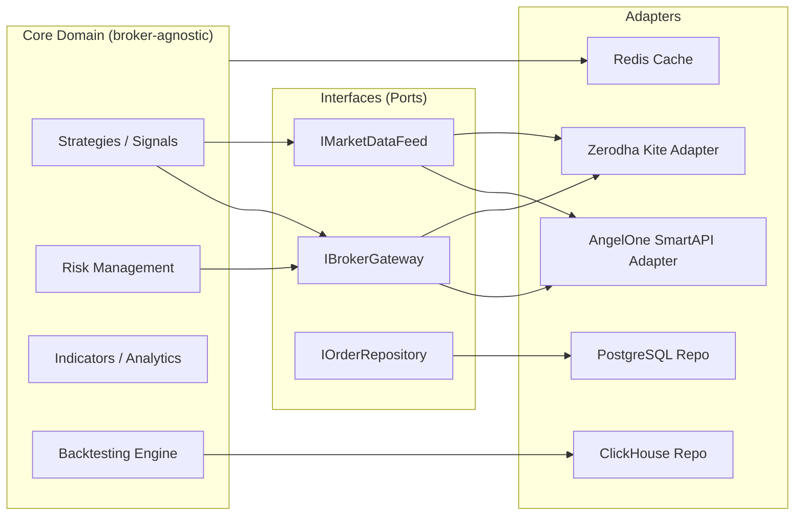

# Quant Trader Engine — Build Workflow

This workflow sequences the implementation so that each phase is independently
testable, broker-agnostic, and shippable. Angel One SmartAPI is the first
adapter; Zerodha Kite is added later behind the same interface with **zero
changes to strategy/service code**.

---

## Guiding principle: Ports & Adapters (Hexagonal Architecture)



Strategy, risk, indicator and backtest code depend only on interfaces defined
in `src/core/interfaces/`. Broker adapters implement those interfaces. Swapping
Angel One → Kite means writing a new adapter class, not touching core logic.

---

## Phase 0 — Project Scaffolding (Day 0–1)

- [ ] Initialize repo, `pyproject.toml`, pre-commit (black, ruff, isort, mypy).
- [ ] Set up folder structure (see below).
- [ ] Docker Compose: PostgreSQL, ClickHouse, Redis, (Kafka stub for later).
- [ ] `.env.example` + `pydantic-settings` based config loader.
- [ ] Logging setup (structured JSON logs, correlation IDs).
- [ ] CI pipeline: lint + type-check + unit tests on push.

**Exit criteria:** `docker compose up` boots all infra; `make test` runs a
placeholder test suite green.

---

## Phase 1 — Core Domain & Broker Abstraction (Day 2–5)

- [ ] Define domain entities: `Order`, `Position`, `Trade`, `Instrument`,
      `Tick`, `Candle`, `Account`.
- [ ] Define interfaces in `src/core/interfaces/`:
      `IBrokerGateway` (connect, place_order, modify_order, cancel_order,
      get_positions, get_holdings, get_margins),
      `IMarketDataFeed` (subscribe, unsubscribe, on_tick),
      `IOrderRepository`, `ITradeRepository`, `IInstrumentRepository`.
- [ ] Implement `AngelOneBrokerAdapter` (SmartAPI: REST + WebSocket) satisfying
      `IBrokerGateway` + `IMarketDataFeed`.
- [ ] Add a `PaperBrokerAdapter` (simulated fills) for safe dry-runs — always
      keep this; use it for every new strategy before real capital.
- [ ] Broker factory / DI container selects adapter from config
      (`BROKER_PROVIDER=angel_one|kite|paper`).

**Exit criteria:** Can authenticate to Angel One sandbox, fetch instruments,
place a paper order, and stream ticks — all through the interface, verified
by contract tests that run against every adapter implementation.

---

## Phase 2 — Market Data Ingestion & Storage (Day 6–9)

- [ ] `MarketDataIngestionService`: consumes ticks from `IMarketDataFeed`,
      normalizes to canonical `Tick` schema, writes to ClickHouse in batches.
- [ ] Redis: latest tick/LTP cache (`SET`/`HSET` with TTL), used for
      low-latency reads by strategies instead of hitting ClickHouse.
- [ ] Candle aggregation service (1m/5m/15m/1d) materialized via ClickHouse
      materialized views or scheduled rollups.
- [ ] Instrument master sync job (from broker + NSE/BSE master files) →
      PostgreSQL `instruments` table.

**Exit criteria:** Live ticks for a watchlist flow into ClickHouse with
<500ms end-to-end latency; Redis reflects LTP within one tick cycle.

---

## Phase 3 — Indicators, Order Flow & Options Analytics (Day 10–14)

- [ ] `indicators/`: stateless, pure functions (SMA/EMA/RSI/MACD/ATR/VWAP...),
      operate on candle series (pandas/numpy or polars), unit-testable
      without any broker/DB dependency.
- [ ] `order_flow/`: bid-ask imbalance, cumulative delta, volume profile —
      consumes tick stream, framework-agnostic.
- [ ] `options_analytics/`: option chain builder, Greeks (Black-Scholes /
      binomial), IV solver, OI change analytics, PCR.
- [ ] All modules exposed as services with clear input/output DTOs — no
      broker imports allowed here (enforce via import-linter/lint rule).

**Exit criteria:** Each module has ≥90% unit test coverage using fixture data,
runs with no network/DB calls.

---

## Phase 4 — Signal Generation & Strategy Layer (Day 15–18)

- [ ] `ISignalGenerator` interface + concrete strategies (e.g., EMA crossover,
      ORB, options-based).
- [ ] Strategies depend only on: indicators, order flow, options analytics,
      `IMarketDataFeed` (for data) and emit `Signal` objects — never call
      broker adapters directly.
- [ ] `StrategyRunner` orchestrates: data → signal → risk check → order
      execution, via injected interfaces (constructor DI).

**Exit criteria:** A strategy runs end-to-end against `PaperBrokerAdapter`
in a replay/backtest and in "live paper" mode with identical code path.

---

## Phase 5 — Risk Management (Day 19–21)

- [ ] Pre-trade checks: max position size, max daily loss, exposure per
      symbol/sector, margin availability, circuit-limit checks.
- [ ] Post-trade: real-time P&L tracking, stop-loss/target monitoring,
      kill-switch (auto flatten + disable strategy on breach).
- [ ] Risk service sits between `StrategyRunner` and `IBrokerGateway` —
      every order must pass through it (no bypass path).

**Exit criteria:** Simulated breach scenarios (daily loss limit, oversized
order) are blocked and logged/alerted correctly.

---

## Phase 6 — Backtesting Engine (Day 22–26)

- [ ] Event-driven backtester reading historical candles/ticks from
      ClickHouse, replaying through the same `ISignalGenerator` +
      `RiskService` + `PaperBrokerAdapter` used live (no separate "backtest
      only" strategy code).
- [ ] Realistic simulation: slippage model, brokerage/STT/taxes, partial
      fills, latency simulation.
- [ ] Store results (equity curve, trades, metrics: Sharpe, Sortino, max DD,
      win rate) in PostgreSQL `backtest_results`.

**Exit criteria:** Same strategy class produces backtest report and live
paper-trading behavior with no code fork.

---

## Phase 7 — API Layer & Observability (Day 27–30)

- [ ] FastAPI routers: `/strategies`, `/backtests`, `/orders`, `/positions`,
      `/instruments`, `/risk`, `/health`, `/metrics`.
- [ ] AuthN/AuthZ (JWT/OAuth2), per-user API keys for broker credentials
      (encrypted at rest, e.g. via `cryptography.Fernet` + KMS/secrets vault).
- [ ] Prometheus metrics + OpenTelemetry tracing; structured logs shipped to
      a central sink.
- [ ] Rate limiting respecting broker API limits (token bucket per broker).

**Exit criteria:** API is documented (OpenAPI), authenticated, observable,
and passes a load test at expected concurrency.

---

## Phase 8 — Hardening & Testing Strategy (ongoing, gate before live capital)

- [ ] Unit tests: indicators, risk rules, signal logic (no I/O).
- [ ] Contract tests: every `IBrokerGateway` implementation (Angel One, Kite,
      Paper) run the same test suite.
- [ ] Integration tests: ingestion → ClickHouse → indicator pipeline, using
      docker-compose test infra / testcontainers.
- [ ] Replay tests: backtest determinism (same seed/data → same result).
- [ ] Chaos/failure tests: broker disconnect/reconnect, WebSocket drop,
      partial order rejection.
- [ ] Paper-trade for a minimum soak period before enabling live orders.

---

## Phase 9 — Migrate/Add Zerodha Kite (Day 31–34)

- [ ] Implement `KiteBrokerAdapter` against `IBrokerGateway` +
      `IMarketDataFeed` (Kite Connect REST + WebSocket ticker).
- [ ] Run the Phase 1 contract test suite against `KiteBrokerAdapter` —
      must pass unmodified.
- [ ] Add instrument-symbol mapping layer (Angel One tokens ↔ Kite
      instrument tokens ↔ canonical internal instrument ID) so strategies
      never see broker-specific symbols.
- [ ] Toggle `BROKER_PROVIDER=kite` in config — no strategy/service code
      changes required. Run both adapters side-by-side in staging to
      cross-validate tick/order parity before cutover.

**Exit criteria:** Full strategy suite (backtest + paper) passes identically
under both `angel_one` and `kite` providers.

---

## Phase 10 — Future Scaling

- [ ] Introduce Kafka between ingestion and downstream consumers
      (indicators, risk, persistence) to decouple and enable horizontal
      scaling of consumers per symbol/partition.
- [ ] Split services into independently deployable containers
      (ingestion, signal-engine, risk-engine, api) behind the same
      interfaces — enabled by DI, not a rewrite.
- [ ] Add ML module as another `ISignalGenerator` implementation (e.g.
      model-serving via a `MLSignalGenerator` calling an inference service).
- [ ] Multi-region/HA PostgreSQL (read replicas), ClickHouse cluster
      sharding by instrument/date, Redis Cluster for cache scaling.

---

## Recommended Folder Structure

```
quant_trader/
├── src/
│   ├── core/
│   │   ├── entities/            # Order, Trade, Position, Instrument, Tick...
│   │   ├── interfaces/          # IBrokerGateway, IMarketDataFeed, I*Repository
│   │   ├── dtos/
│   │   └── exceptions/
│   ├── brokers/
│   │   ├── base.py              # shared adapter helpers
│   │   ├── angel_one/
│   │   ├── kite/
│   │   └── paper/
│   ├── market_data/              # ingestion, normalization, candle rollups
│   ├── indicators/                # pure, stateless calculations
│   ├── order_flow/
│   ├── options_analytics/
│   ├── risk/
│   ├── signals/                   # ISignalGenerator implementations/strategies
│   ├── backtesting/
│   ├── services/                  # orchestration layer (StrategyRunner etc.)
│   ├── repositories/               # PostgreSQL/ClickHouse/Redis implementations
│   ├── api/                        # FastAPI routers, schemas, dependencies
│   ├── infra/                      # db sessions, redis client, kafka client, DI container
│   ├── config/                     # settings, environment loading
│   └── utils/
├── tests/
│   ├── unit/
│   ├── contract/                   # broker adapter contract tests
│   └── integration/
├── migrations/                     # Alembic (Postgres), ClickHouse DDL scripts
├── scripts/                        # instrument sync, backfill, ops scripts
├── docker/                         # Dockerfiles, docker-compose.yml
├── .env.example
├── pyproject.toml
├── requirements.md
├── workflow.md
└── README.md
```

---

## Recommended Design Patterns Used

| Pattern | Where |
|---|---|
| Ports & Adapters (Hexagonal) | Broker abstraction |
| Repository | Data access (Postgres/ClickHouse/Redis) |
| Strategy | `ISignalGenerator` implementations |
| Factory | Broker adapter selection via config |
| Dependency Injection | Constructor injection everywhere, container in `infra/` |
| Observer/Pub-Sub | Tick → consumers (indicators, risk, persistence) |
| Unit of Work | Order placement transactions across repos |
| Decorator | Rate limiting, retry, circuit breaker around broker calls |
| Template Method | Backtest vs live execution sharing the same strategy loop |
